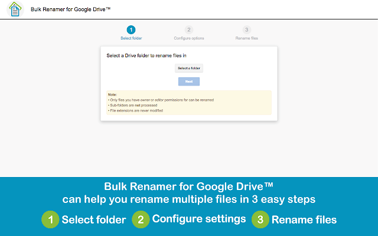
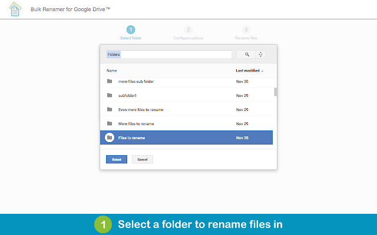
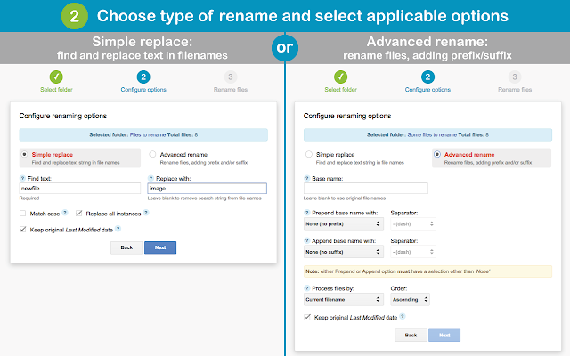
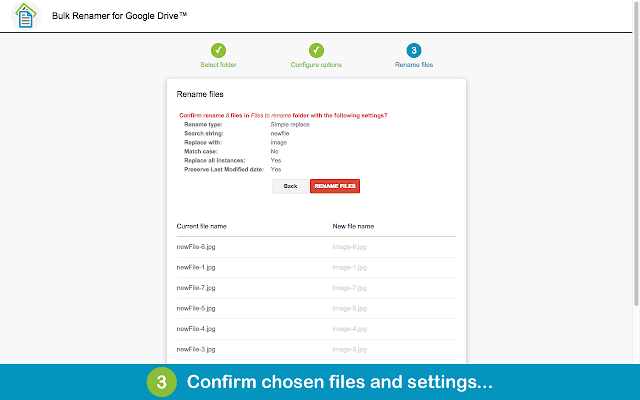
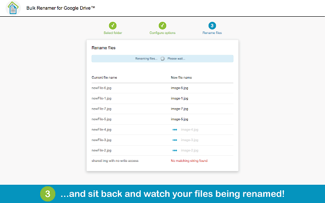

**Bulk Renamer for Google Drive™** renames all files in selected Drive folder according to chosen settings. 

No more need to sync files to your desktop, rename them using OS-specific tools and sync them back to Drive. Just select a folder, choose rename options (see details below) and sit back and watch your files being renamed!

3 easy steps:

### 1. Select a Folder
Use Drive Picker to select a folder to rename files in. 
_**Note:** Only folders you are the owner of can be selected. Sub-folders are not processed. Only files you have owner or editor permissions for can be renamed._

### 2. Choose Rename Options
Choose between _Simple Replace_ and _Advanced Rename_, with available options as follows:

**Simple Replace:**
- Find text (string to look for in file names)
- Replace with string (text to replace search string with; leave blank to remove search string from file names)
- Match case (whether to perform case-sensitive search or nor)
- Replace all instances (whether to replace all occurrences of search string in file names or only the first one)
- Keep original Last Modified date (whether to preserve file modification date or update it with current date)

**Advanced Rename:**
- Base name (base filename part to give all files; leave blank to use original file names)
- Prepend base name with (prefix to add to all filenames; select between none, numeric iterator or timestamp)
- Prefix separator (select character to separate prefix and base name with)
- Start numbering from (for Numeric iterator prefix type, the number to start iterating from)
- Append base name with (suffix to add to all filenames; select between none, numeric iterator or timestamp)
- Suffix separator (select character to separate base name and suffix with)
- Start numbering from (for Numeric iterator suffix type, the number to start iterating from)
- Process files by (

### 3. Confirm Settings and Rename Files
Confirm selected rename options and preview list of files with new filenames. Watch your files being renamed in real-time. Results page will show any errors encountered during rename (e.g. files with no matching string in filename, or files with insufficient access permissions)
_**Note:** It can take your Google Drive™ user interface a few seconds to update with new file names after a bulk rename._

### Reporting Issues / Feature Requests

Please report any issues or suggest feature ideas on the project's [Issues page](https://github.com/azadisaryev/BulkRenamerForGoogleDrive/issues).

### Feature Images

_Google Drive is a trademark of Google Inc. Use of this trademark is subject to Google Permissions._
